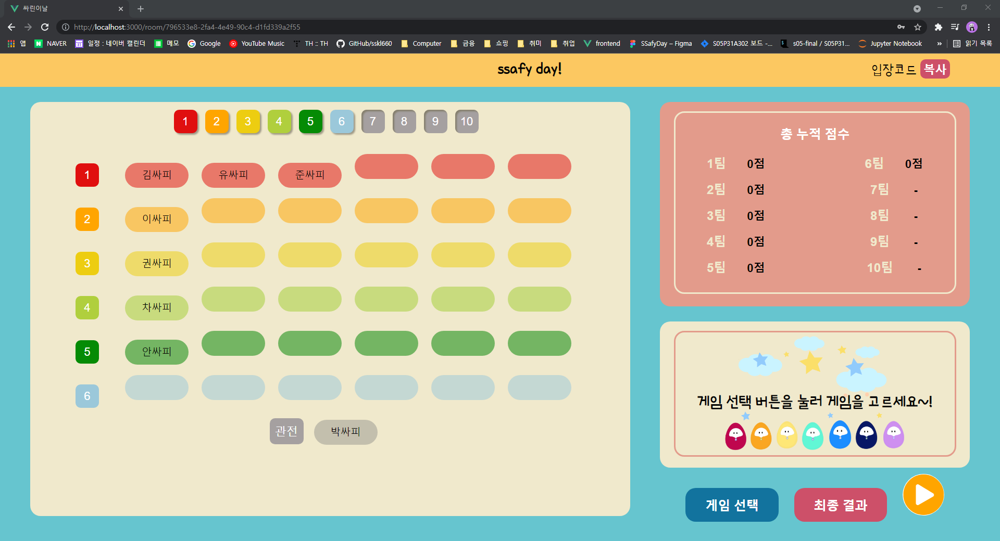
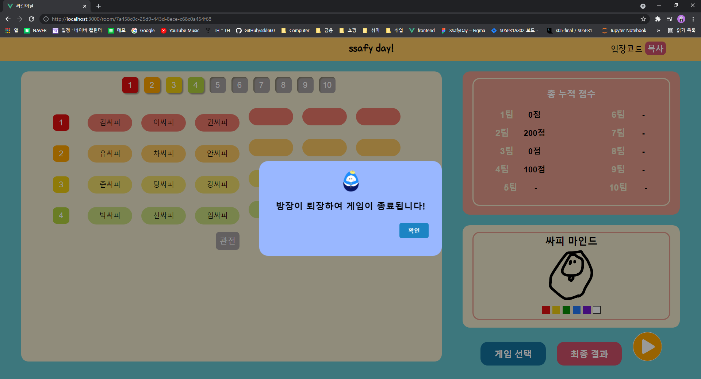

# 📚Scenario

### 👨‍🎓시연 시나리오를 간략하게 설명드립니다.

- 메인 페이지

  

- 게임을 만들고 싶은 경우 로그인을 해야 합니다

  

- 간단한 방법으로 회원가입이 가능합니다

  

- 방 제목을 입력하면 게임 방을 생성할 수 있습니다

  

- 대기실 페이지

  - 대기실 입장시 기본 화면입니다.

    

  - 상단 버튼을 눌러 팀을 활성화 할 수 있습니다. 팀원이 활성화되면, 우측의 총 누적점수 창도 활성화 됩니다.

    

  - 우상단의 입장 코드를 복사하여 입장 방을 정해줄 수 있습니다.

    

  - 받은 입장코드를 기반으로 사용자는 방장이 만든 방에 접속이 가능합니다.

    

  - 입장한 유저는 관전 및 활성화된 팀에서 원하는 팀을 골라서 이동이 가능합니다.

    

  - 방장은 게임 선택을 이용하여 하고 싶은 게임을 선택할 수 있습니다.

    

  - 유저는 방장이 고른 게임 정보와 무관하게 어떤 게임이 있는지 설명을 확인할 수 있습니다.

    

  - 게임을 선택하고 우하단의 게임 시작 버튼을 클릭하면 게임으로 이동합니다.

    

- 싸피마인드

  - 시작시, 게임의 간단한 설명을 모든 유저에게 팝업합니다.

    

  - 게임이 시작하면 팀의 진행 순서를 안내해줍니다.

    

  - 게임이 시작하면 우상단에 팀별 문제 제한시간이 주어지고, 문제를 내는 팀에서는 유저가 계속하며 바뀌며 그림을 그릴 수 있습니다.

    

    10초마다 그림을 그릴 수 있는 플레이어가 변화합니다. 그림을 그릴 수 없는 사람은 아래 팔레트를 선택할 수 없고, 그림도 그리지 못합니다.

    

    다음과 같이 그림을 그릴 수 있는 사람은 아래 팔레트가 활성화되고, 그림을 그릴 수 있습니다.

    

  - 만일 아무도 제한시간내에 문제를 맞추지 못한다면 다음과 같은 메세지가 팝업됩니다.

    

  - 우측과 같이 팀의 색깔별로 채팅이 표시되며, 정답을 맞춘 경우 해당 정답이 하이라이트 됩니다. 또한 이와 더불어 정답 및 점수 획득 여부가 팝업되며, 왼쪽에 있는 값이 갱신되며 랭킹이 바로 보여집니다.

    

  - 게임이 종료되면, 총점수에 따라 결과를 팝업하고 게임이 종료됩니다.

    

  - 방장이 게임을 중단시키거나 대기실로 이동하면, 다음과 같이 모든 사람이 함께 퇴장됩니다.

    

- 또박또박말해요

  -  시작시, 배치된 순서대로 위에 띄어진 문장을 차례대로 말합니다.

    

  - 한 사람씩 해당 문장을 맞출때까지 아래 마이크를 클릭하여 문장을 따라 읽습니다.

    

  - 한 팀이 모두 문제를 맞추면 다음 팀으로 이동하고, 좌측 점수가 갱신됩니다.

    

- 싸집이 점프

  - 게임을 시작하면 관련 설명을 보여줍니다.

    

    

    

  - 게임을 진행합니다. 적절한 타이밍에 space를 눌러 장애물을 피합니다.

    
    
  - 장애물에 걸리는 순간 관련 메세지를 띄웁니다.

    

- 결과

  - 현재까지 결과를 집계하여 보여줍니다.

    

  - 종료 버튼을 누르면 방장은 room으로, 유저는 Home화면으로 이동합니다.

    
