# 🎈싸린이날

> 2021.10.11 ~ 2021.11.26
>
> ### Team
>
> - 이장섭 : Back-End Developer, Project Manager
> - 권희은 : Front-End Developer
> - 김태현 : Back-End Developer
> - 안기훈 : Front-End Developer
> - 차은채 : Front-End Developer

**서비스 개요**

'싸린이날'은 비대면 시대에 코딩을 위해 공부하는 부트캠프 학생들에게 개발자로서의 필수 미덕인 협동신을 키우고 팀워크를 다질 수 잇는 경험을 제공하는 서비스입니다.

**[서비스 바로가기](http://j5a301.p.ssafy.io/)**, **[유튜브](https://youtu.be/MdbGxToE6r4)**


## ✨기획

### 주제 선정

스타트 캠프, 오리엔테이션, 부트캠프, 싸피데이 그리고 지금 하고 있는 프로젝트까지 다양한 방식으로 협업을 해왔습니다. 하지만 직접 만날 수 있는 오프라인보다 상대적으로 온라인 환경에서 함께 유대감을 쌓고 팀을 형성하는 것이 어렵게 다가왔습니다.

비대면으로 협업이 이뤄지는 환경에서 빠르게 단합하고 친목을 도모하기 위해 '협업 게임'을 생각했고, '싸린이날'을 기획하게 됐습니다. 최종적으로 결정한 3가지 게임은 '싸피 마인드', '또박또박 말해요', '싸집이 점프'입니다.


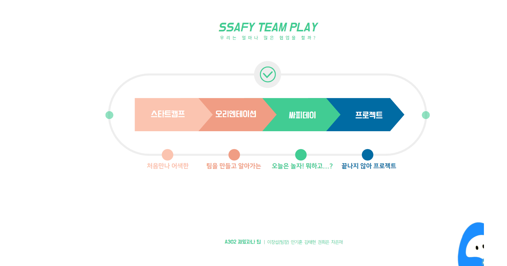


## 🖇아키텍처 설계

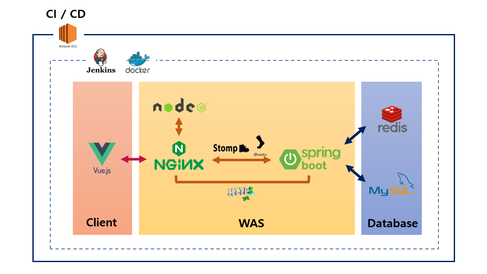


## 🎆프로토타입

* 참여코드를 입력하면 대기실로 이동해 3가지 게임을 즐길 수 있습니다.
* 방만들기를 할 경우에는 방을 생성해 방장 자격으로 게임 전반의 컨트롤을 담당합니다.
* 웹게임인만큼 밝고 톡톡튀는 재미를 느낄 수 있는 UI를 만들었습니다.

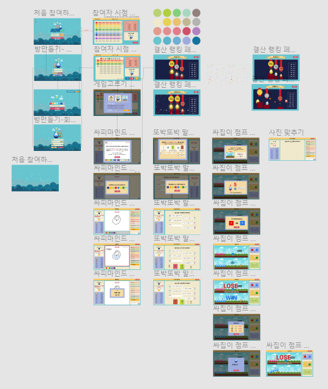


## 💎게임소개

"협동심"을 주제로하는 세 가지 게임을 구현하였습니다.

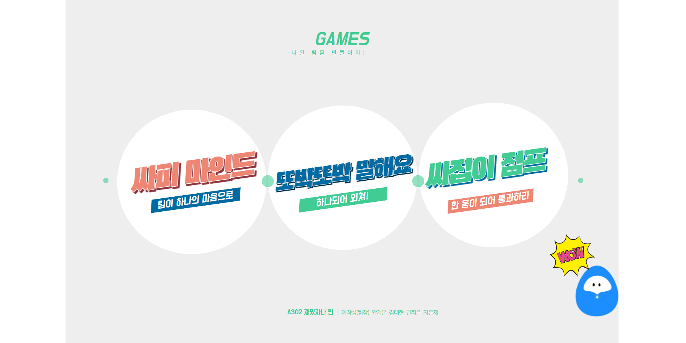


## 1. 싸피마인드

### 하나의 마음으로 그려라

싸피마인드는 팀원들이 협력하여 하나의 그림을 그려나가는 게임입니다. 일정 시간 동안 순서대로 번갈아가며 주제에 맞는 그림을 그리면 다른 팀이 문제를 맞추게 됩니다.

- 팀원이 순서대로 시간 안에 그림을 그려서 하나의 그림을 완성 시킵니다.
- 제시어를 빠르게 맞힌 팀이 점수를 획득합니다.
- 출제자는 정답을 맞추는 사람뿐만 아니라 팀원들의 생각까지 고려해야 합니다.

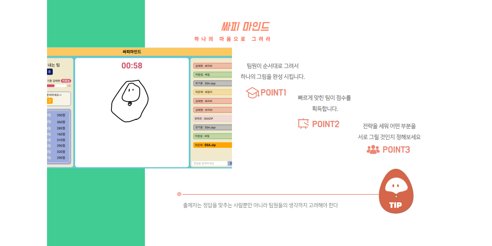


## 2. 또박또박말해요
### 하나되어 외쳐라

윗쪽에 제시어가 나오고 음성 인식 API를 이용해 제시어와 동일한 문장을 읽고 완성시키면 통과합니다. 팀원들이 순서대로 진행하며, 팀원 모두가 통과했을 때 시간을 기준으로, 순위를 측정하게 됩니다.

- 하나의 문장을 팀원들이 순서대로 정확하고 빠르게 말합니다.
- 팀원이 실수하더라도 참고 기다리며 응원합니다.
- 다른 팀을 응원하거나 친구의 혀가 꼬이는 것을 구경해봅니다.

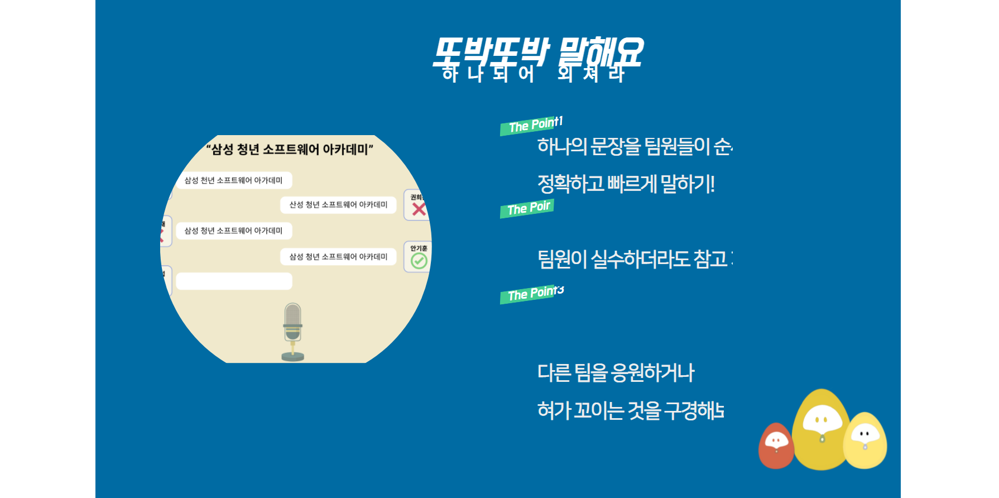


## 3. 싸집이점프게임

* 모든 팀원이 날아오는 장애물을 뛰어넘어야합니다. IT 장애물을 뛰어 넘으면서 협동심을 기르는 게임입니다.
* 위 아래 각 팀이 배정되며 본인 캐릭터 위에는 빨간색 화살표 표시가 뜹니다.
* 상대방 팀을 이기면 우승자가 나올 때까지 토너먼트로 진행됩니다.
* 총 3라운드로 이 중 2번을 먼저 이기면 승리하게 됩니다.

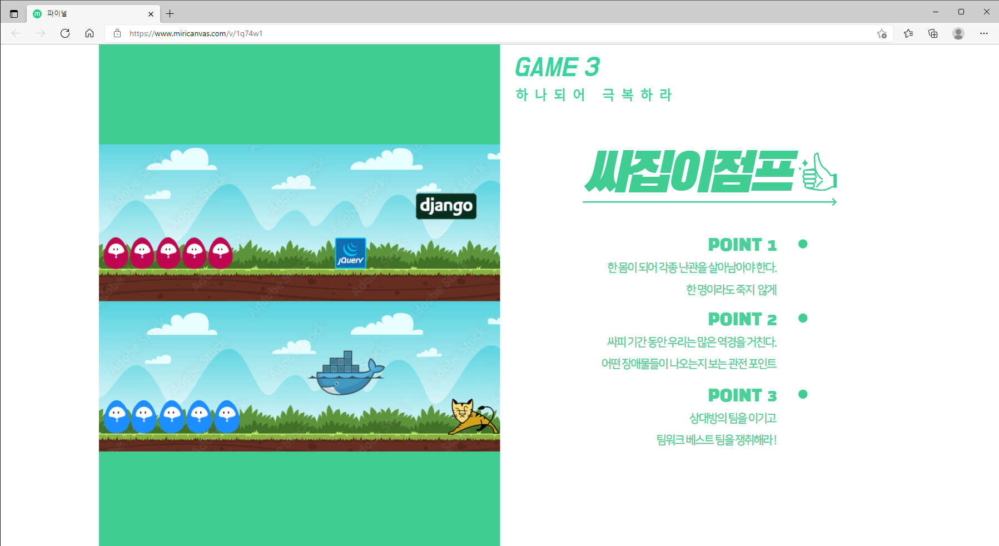


## 🏆프로젝트에서 얻은점

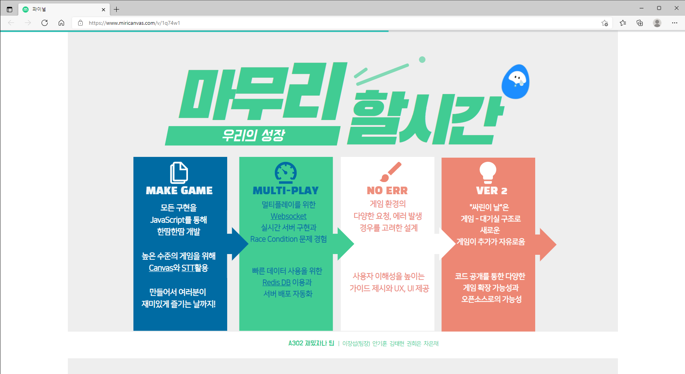

<br>

## 🔦Usage

**Frontend**

```shell
cd frontend
yarn install
yarn start
```

**Backend**

```shell
cd backend
./gradlew build
cd build/libs
java -jar PLAYSSAFY-0.0.1-SNAPSHOT.jar
```

<br>

## Burndown Chart

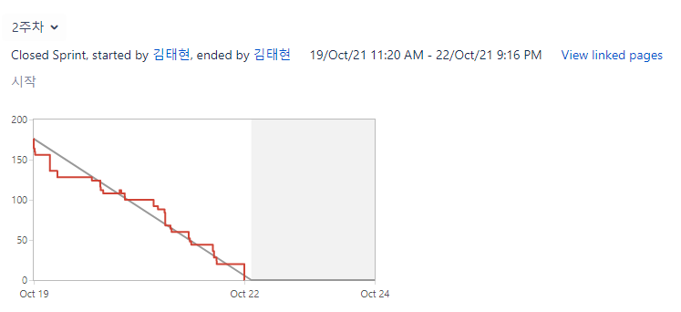

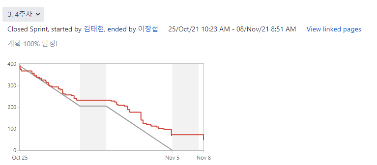

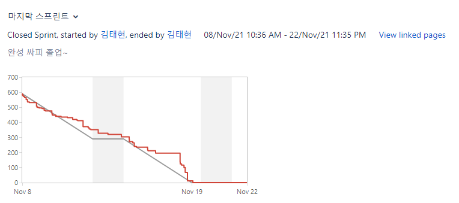

<br>

## 🌏Environment

## Frontend

### IDE

- Visual Studio Code 1.59.0

### JavaScript

- Node.js 14.16.0

### Framework

- Vue/CLI 4.5.13


## Backend

### IDE

- Intellij IDEA 2021.1.3(Ultimate Edition)

### Java

- OpenJDK 11.0.1

### Spring Boot

- spring boot 2.5.3
- Gradle 7.1.1


## Database

- MySQL 15.1 Distrib 10.6.3-MariaDB, for debian-linux-gnu
- Redis_version 6.2.6


## Infra

- Ubuntu 20.04 LTS
- Docker 20.10.7
- Jenkins 2.304


## 사용 협업 툴

- 회의 : Webex, Zoom, Discord
- 이슈 트래킹 : JIRA
- 대화 : Slack
- 문서 : Notion
- 디자인 : Figma
- 버전 관리 : Git
